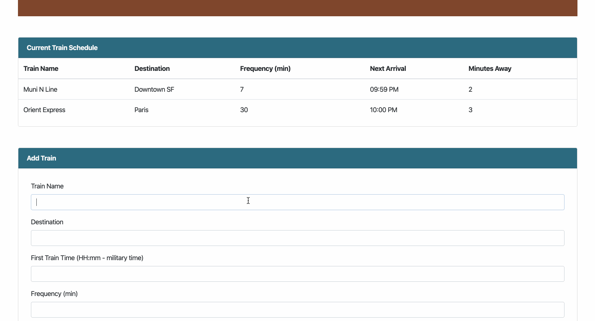

# Train-Scheduler

This web application incorporates Firebase to host arrival and departure data of various trains. Using Moment.js, the app calculates next arrival time and minutes to arrival.

## Technologies used

* Firebase Realtime Database
* Moments.js
* JQuery
* JavaScript
* HTML5
* CSS
* Bootstrap

## GIF Walkthrough

## Essential Code

